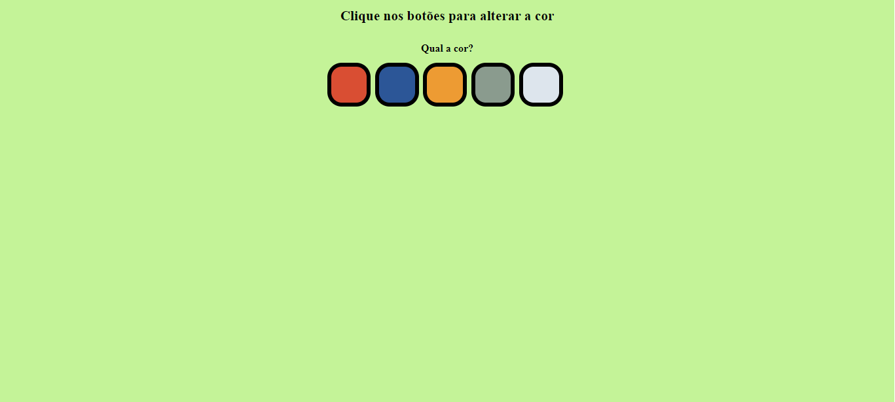

# Altera fundo (PROJETO PARA ESTUDO)

## 🏗️ O projeto
Este projeto é uma página em HTML, CSS e JS e, contém botões coloridos para o usuário alterar a cor do fundo da página.

## 💡 Como rodar o projeto
Bastar clicar duas vezes no arquivo *index.html* da pasta de projeto.

Alternativamente, pode usar a extensão a extensão [Live Server](https://marketplace.visualstudio.com/items?itemName=ritwickdey.LiveServer) da IDE Visual Studio Code para rodar.

## 👨‍💻 Como usar o projeto
Uma vez que a aplicação esteja rodando, clique no círculo cinza para alterar a cor do fundo para cinza.

## Tecnologias usadas no projeto
- HTML
- CSS
- JavaScript
- IDE VSCode

## Features do projeto
- 5 botões coloridos que servem como botão para alterar a cor do fundo.
- Subtítulo que será atualizado com a cor atual do fundo.

## Como o projeto está organizado
* pasta raíz
    - index.html contém o HTML da aplicação.
    - style.css contém os estilos da aplicaão.
    - script.js contém os códigos javascript.

## Como o projeto foi implementado
Este projeto foi implementado co HTML, CSS e JavaScript.

No Javascript os botões definidos no HTML são capturados por um getElementsByTagName e é adicionado um event listner a cada um ddos botões.

Ao clicar em um dos botões, é disparado um evento que irá alterar a cor do fundo da página e o subtítulo será atualizado com o código da cor armazenada no array.

## Dependências principais
O projeto não tem dependências.

## Links úteis
- [Licenciamento github](https://docs.github.com/pt/repositories/managing-your-repositorys-settings-and-features/customizing-your-repository/licensing-a-repository)

## Como contribuir com o projeto
[Veja aqui](./CONTRIBUTING.md)

## Pessoas que contribuíram com o projeto - Deixo aqui todo meu agradecimento
- [Fernando Golinelli](github.com/fgolinelli) - Mantenedor principal

## Precisa de ajuda?
- Fernando Golinelli (mantenedor) - fernando@golinelli.eti.br
